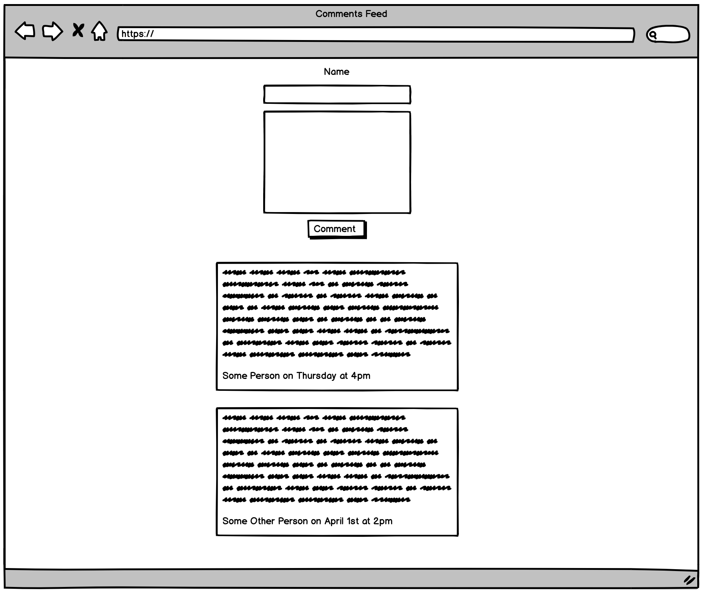

# Front-end Choose Your Own Adventure Take-Home

Design and build a comments feed that displays all comments and notifies a user in real-time when new comments are added.

Here is the data schema for a Comment:
* id: INTEGER
* name: TEXT
* created: DATETIME
* message: TEXT

Here are the API endpoints:
* Create a comment: /createComment (POST)
* Retrieve all comments: /getComments (GET)
* Retrieve a comment: /getComment (GET)
* Delete all comments: /deleteComments (DELETE)
  * This is useful for purging data

This is a basic wireframe, you can change the layout. While you won't be screened as a product designer, make sure you build a good user experience. If you decide to use a third-party design system, be prepared to discuss your decision.



Please write unit tests and handle errors where you see fit.

## Engineering Style

We do not expect you to have expertise in all the topics that encapsulate front-end web development. We recognize that some folks are specialists and others are generalists!

### Specialist

If there's a particular topic you enjoy, you can focus your assignment solution on that!

Some examples include:
* Performance optimizations
* Accessibility
* Integration testing

### Generalist

If you're a generalist, you can focus more on building the minimum viable product described above with the wireframe!

## Interview Details

We have already set up an API client for a Node Express server that stores comments in SQLite.

You have the option of doing the assignment with or without a front-end JS framework.

If you decide to use a framework, we recommend the following boilerplates:
* [facebook/create-react-app](https://github.com/facebook/create-react-app)
* [vuejs/vue-cli](https://github.com/vuejs/vue-cli)
* [angular/angular-cli](https://github.com/angular/angular-cli)
* [ember-cli/ember-cli](https://github.com/ember-cli/ember-cli)

Be prepared to have a discussion about your implementation. Here are some example discussion questions:
* How can you optimize fetching new comments in real-time?
* Are there any restrictions we should place on the comment input?

We recommend spending up to four hours on this assignment. If you don't get every piece you hoped completed done in the timeframe, that's alright! We'll be having an hour long discussion on your thought processes and where you might spend more time, and that discussion is a key part of our evaluation!

## Usage

### Run in Development

```
$ npm install
$ npm run dev
```


----------------------


# Getting Started with Create React App

This project was bootstrapped with [Create React App](https://github.com/facebook/create-react-app).

## Available Scripts

In the project directory, you can run:

### `npm start`

Runs the app in the development mode.\
Open [http://localhost:3000](http://localhost:3000) to view it in the browser.

The page will reload if you make edits.\
You will also see any lint errors in the console.

### `npm test`

Launches the test runner in the interactive watch mode.\
See the section about [running tests](https://facebook.github.io/create-react-app/docs/running-tests) for more information.

### `npm run build`

Builds the app for production to the `build` folder.\
It correctly bundles React in production mode and optimizes the build for the best performance.

The build is minified and the filenames include the hashes.\
Your app is ready to be deployed!

See the section about [deployment](https://facebook.github.io/create-react-app/docs/deployment) for more information.

### `npm run eject`

**Note: this is a one-way operation. Once you `eject`, you can’t go back!**

If you aren’t satisfied with the build tool and configuration choices, you can `eject` at any time. This command will remove the single build dependency from your project.

Instead, it will copy all the configuration files and the transitive dependencies (webpack, Babel, ESLint, etc) right into your project so you have full control over them. All of the commands except `eject` will still work, but they will point to the copied scripts so you can tweak them. At this point you’re on your own.

You don’t have to ever use `eject`. The curated feature set is suitable for small and middle deployments, and you shouldn’t feel obligated to use this feature. However we understand that this tool wouldn’t be useful if you couldn’t customize it when you are ready for it.

## Learn More

You can learn more in the [Create React App documentation](https://facebook.github.io/create-react-app/docs/getting-started).

To learn React, check out the [React documentation](https://reactjs.org/).

### Code Splitting

This section has moved here: [https://facebook.github.io/create-react-app/docs/code-splitting](https://facebook.github.io/create-react-app/docs/code-splitting)

### Analyzing the Bundle Size

This section has moved here: [https://facebook.github.io/create-react-app/docs/analyzing-the-bundle-size](https://facebook.github.io/create-react-app/docs/analyzing-the-bundle-size)

### Making a Progressive Web App

This section has moved here: [https://facebook.github.io/create-react-app/docs/making-a-progressive-web-app](https://facebook.github.io/create-react-app/docs/making-a-progressive-web-app)

### Advanced Configuration

This section has moved here: [https://facebook.github.io/create-react-app/docs/advanced-configuration](https://facebook.github.io/create-react-app/docs/advanced-configuration)

### Deployment

This section has moved here: [https://facebook.github.io/create-react-app/docs/deployment](https://facebook.github.io/create-react-app/docs/deployment)

### `npm run build` fails to minify

This section has moved here: [https://facebook.github.io/create-react-app/docs/troubleshooting#npm-run-build-fails-to-minify](https://facebook.github.io/create-react-app/docs/troubleshooting#npm-run-build-fails-to-minify)
